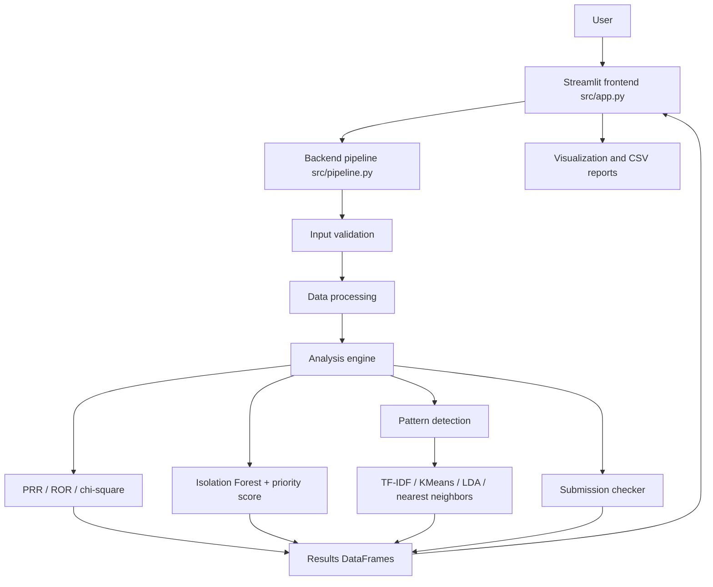

# Architecture

## System architecture

IBM Bob sits **outside** this runtime diagram. It was used during development (architecture planning, code generation, explanation, refactoring, testing, and documentation). The running app does not send data to Bob, watsonx.ai, or other hosted models.

## Components

| Component | Technology | Responsibility |
|---|---|---|
| Dashboard | Streamlit | Navigation, uploads, metrics, tables, downloads, error messages |
| Data processor | Pandas | CSV parse, required-column checks, missing/duplicate handling |
| Pattern detection | scikit-learn TF-IDF, KMeans, LDA, NearestNeighbors | Cluster narratives, topics, similar reports |
| PRR / ROR / chi-square | NumPy | 2x2 disproportionality screening |
| Anomaly ranking | scikit-learn Isolation Forest | Flag unusual drug-event pairs in this file |
| CTD checker | Python / Pandas | Map outline lines to representative ICH M4 sections and score modules |
| Explanations | Rule-based Python | Plain-language PRR and gap text without an API |
| Visualizations | Plotly | PRR bars, frequencies, cluster counts, module scores |
| Tests | pytest | PRR edge cases, validation, completeness math |

## Component responsibilities

- `src/app.py` is the Streamlit frontend (widgets, tables, charts, downloads).
- `src/pipeline.py` is the backend entry the frontend calls.
- `src/prr_analysis.py` is the source of truth for screening math.
- `src/submission_checker.py` owns the representative checklist and weights.
- `src/sample_data/` provides immediately runnable synthetic inputs. It is named `sample_data` because the template `.gitignore` ignores any folder named `data/`.

## End-to-end data flow

1. The reviewer starts Streamlit and chooses a mode.
2. **Signal path:** CSV bytes are parsed. Required `drug_name` and `adverse_event` columns are validated. Invalid and duplicate rows are dropped. Combinations become a, b, c, d. PRR is computed only when margins allow. Results are ranked, explained, plotted, and downloaded.
3. **CTD path:** Outline text is split into section lines. Each expected representative section is marked Present or Missing. Module completeness and a weighted overall score are calculated. High-priority gaps drive recommended next actions. The gap table is downloaded.

## Security considerations

- No API keys or passwords are required or hard-coded.
- `.env` is gitignored. `src/.env.example` documents that secrets are unused.
- Uploaded files stay in the local Streamlit session; nothing is posted to a cloud AI service.
- This prototype does not implement authentication; it is intended for local demo use.

## Scalability considerations

The current design loads one CSV into memory, which is appropriate for a hackathon sample and for modest extracts. A production pharmacovigilance platform would need case-level data quality pipelines, validated statistical methods beyond PRR, access control, and audit logs. Those systems are out of scope. Horizontal scale is not required for the demo; the bottleneck would be Pandas memory on very large FAERS extracts, which could later be processed in chunks without changing the PRR formula.
